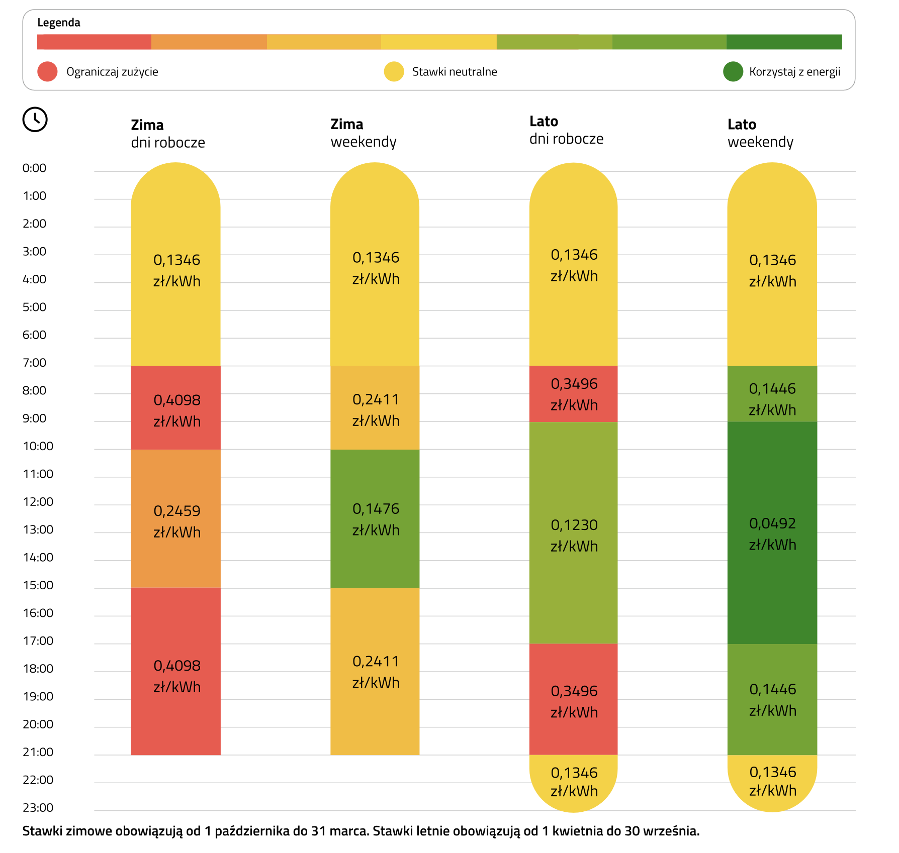

# shelly-scripts

Shelly Scripts for devices like Shelly Plug S Gen3

## Shelly Plug S Gen3

__Configuration of the scripts:__

Add the script to your Shelly PlugS Gen3 device in settings: http://192.168.1.57/#/scripts (use your Shelly device IP to connect).

### Script: LED Light match Tauron G13s tariff

__Configuration of the script:__

Ensure `Run on startup` is `ON`.

__About the script:___

The LED light matches Tauron G13s tariff.

For clarity between 🟡 yellow & 🟠 orange colors, we use 💠 light blue for the night tariff. You can use the LED as a night light then.

In winter weekend we use 🟢 dark green for the cheapest period, because that's the cheapest you can get during winter.

Summer has two green colors:

* 🍏 light green - for cheap hours during workdays
* 🟢 dark green - for the cheapest hours during weekend

### Script: Temperature Checker

Check the device temperature every 10 seconds and show in diagnostics logs.
